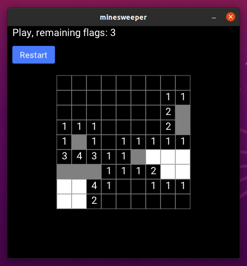

# Minesweeper

Minimal _Minesweeper_ clone written in _Elixir_ and [Scenic](https://github.com/boydm/scenic) library.



## How to run

```
mix deps.get
mix compile
mix scenic.run
```

If any of the system dependencies are missing, take a look [here](https://hexdocs.pm/scenic/install_dependencies.html).
